# Shape Geometry Dataset

Synthetic graph-based centerline representations of 3D geometric motifs (pipe-like structures).

## JSON Schema

`dataset.json` is an array of shape records. Each record:

```json
{
  "category": "arc_90",
  "nodes": [[x, y, z], ...],
  "edges": [[i, j], ...],
  "features": {
    "curvature": [0.0, 0.1, ...],
    "segment_angle": [0.0, 160.5, ...]
  }
}
```

| Field | Type | Description |
|-------|------|-------------|
git fi| `category` | string | Shape class label (e.g. `straight`, `arc_90`, `corner`, `junction`) |
| `nodes` | float[][] (N x 3) | 3D points with ~1-unit spacing between neighbors |
| `edges` | int[][] (E x 2) | Index pairs connecting nodes |
| `features.curvature` | float[] (N) | Menger curvature per node (0 at endpoints/hubs) |
| `features.segment_angle` | float[] (N) | Angle in degrees between edges at each node |

## Categories

| Category | What it is | Samples |
|----------|-----------|---------|
| `straight` | Random-length line segment (5-20 units) | 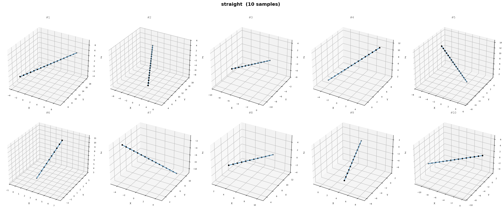 |
| `arc_10` | 10 deg gentle arc | 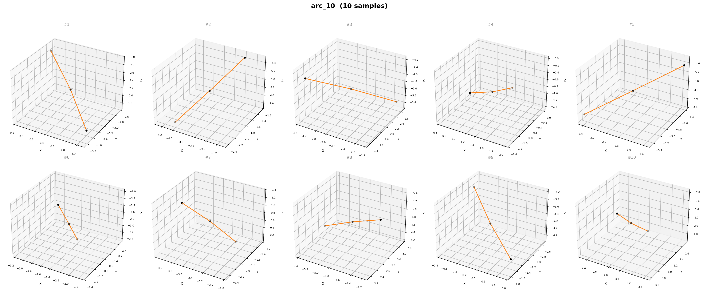 |
| `arc_20` | 20 deg arc | 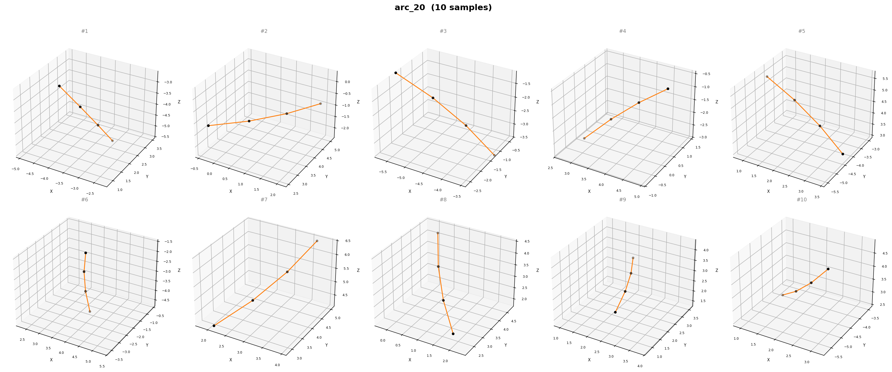 |
| `arc_30` | 30 deg arc | 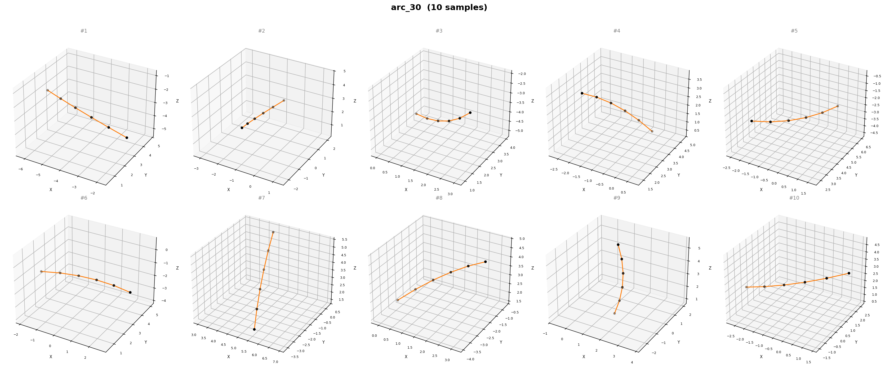 |
| `arc_40` | 40 deg arc | 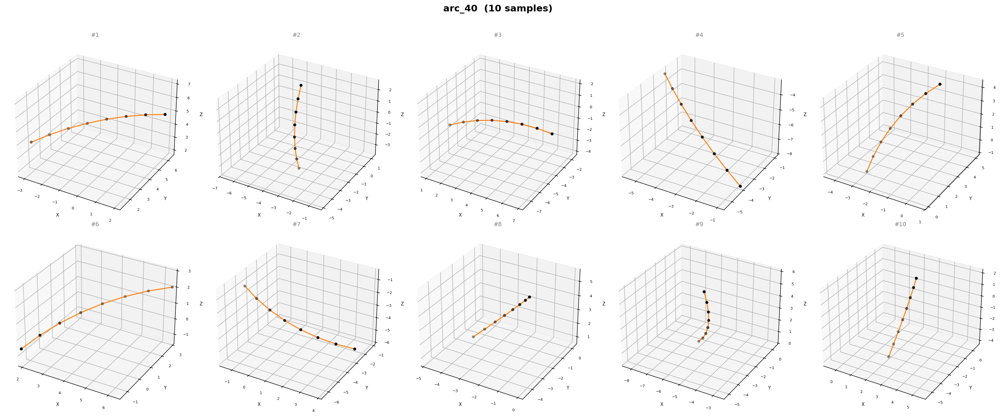 |
| `arc_50` | 50 deg arc | 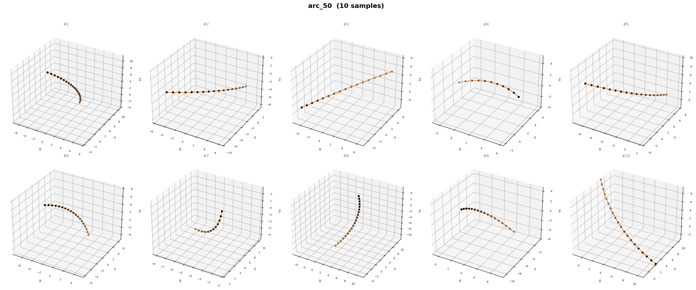 |
| `arc_60` | 60 deg arc | 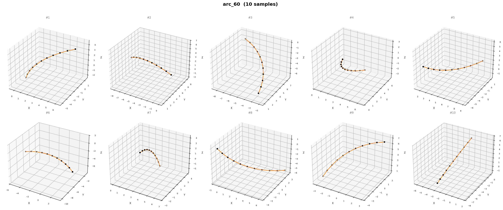 |
| `arc_70` | 70 deg arc | 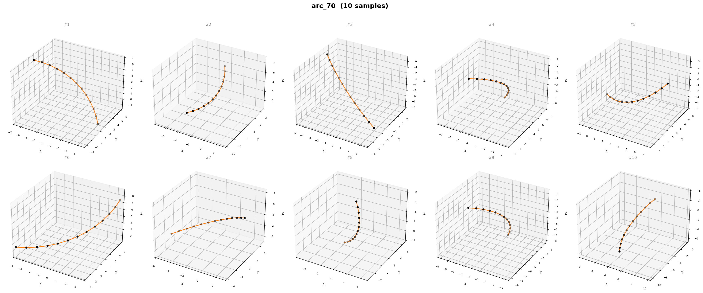 |
| `arc_80` | 80 deg arc | 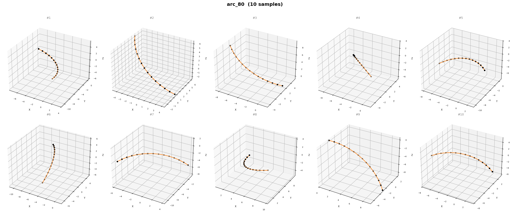 |
| `arc_90` | 90 deg quarter-circle bend | 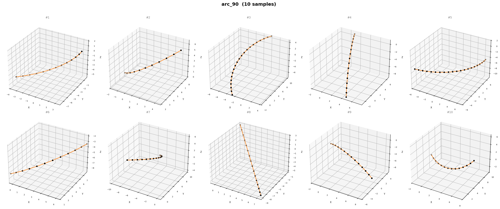 |
| `arc_100` | 100 deg arc | 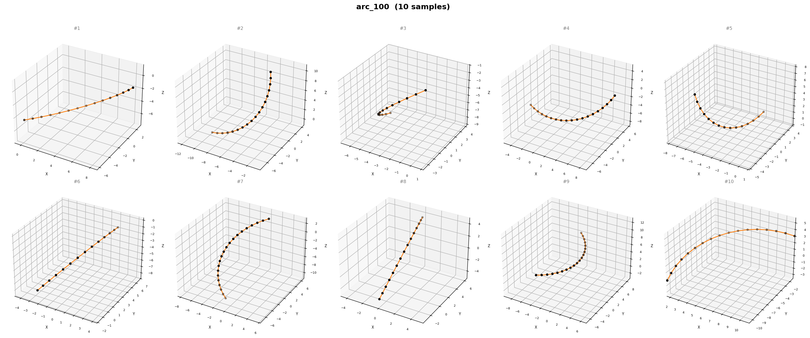 |
| `arc_110` | 110 deg arc | 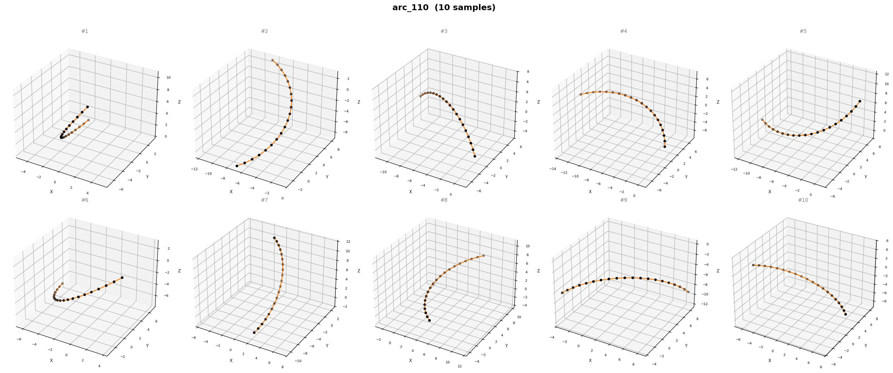 |
| `arc_120` | 120 deg wide arc | 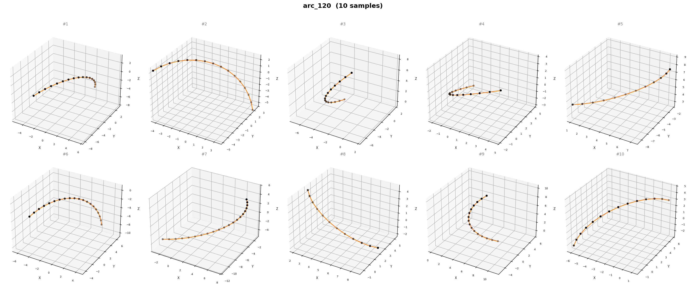 |
| `arc_130` | 130 deg arc | 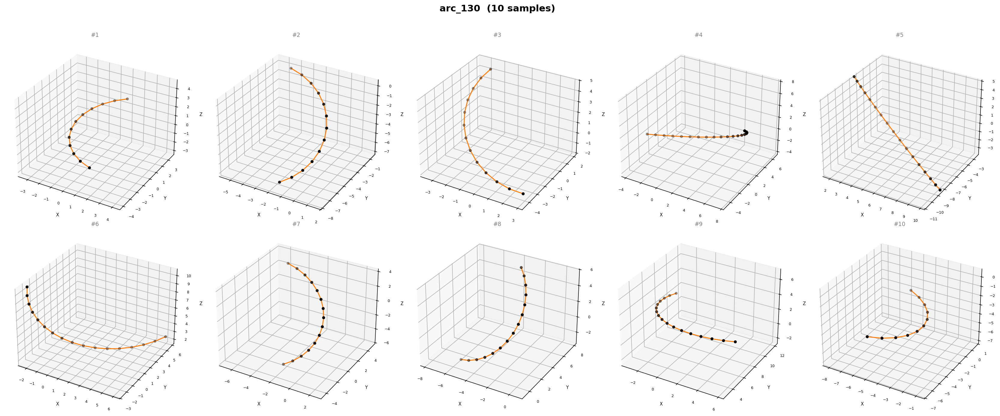 |
| `arc_140` | 140 deg arc | 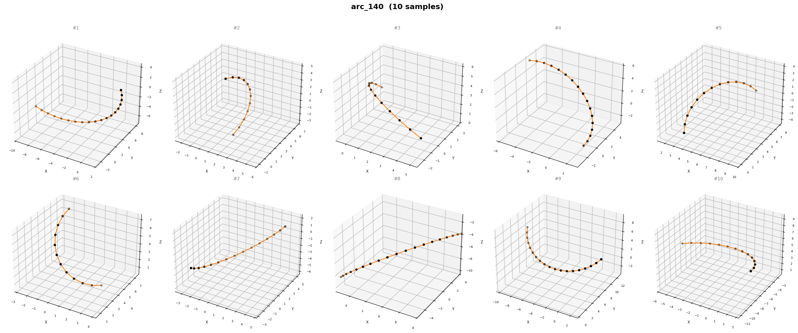 |
| `arc_150` | 150 deg near-semicircle | 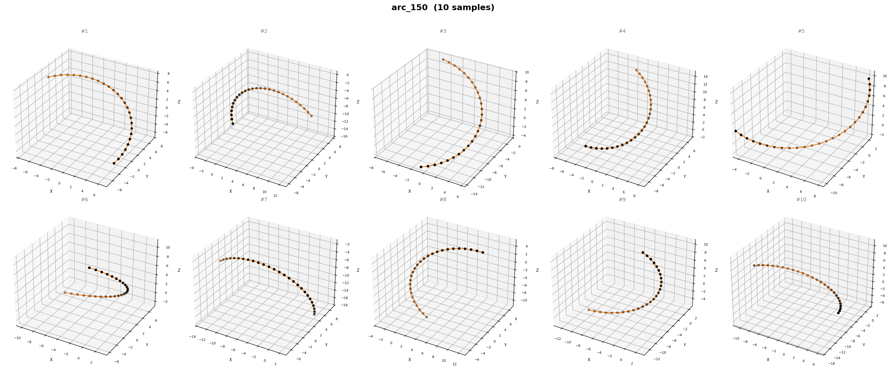 |
| `arc_160` | 160 deg arc | 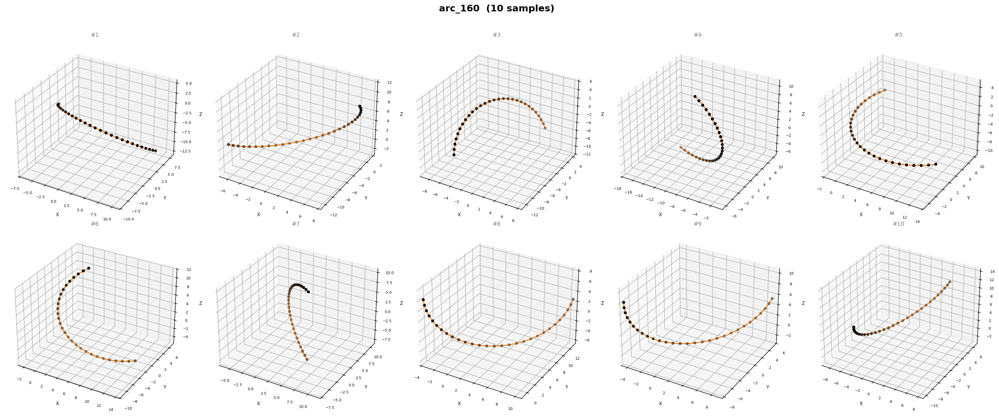 |
| `arc_170` | 170 deg near-full semicircle | 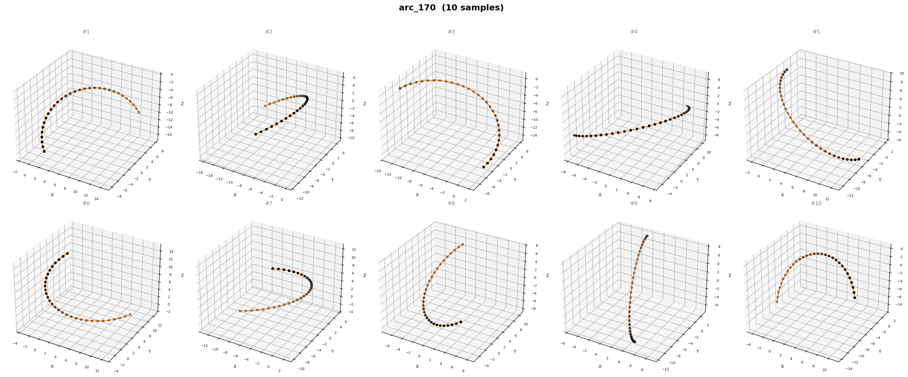 |
| `corner` | Two straight arms at a sharp 90 deg angle | 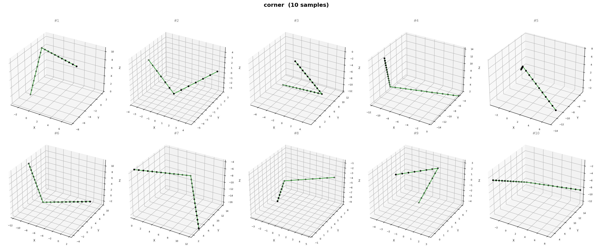 |
| `junction` | T or Y junction (3 arms meeting at a hub node) | 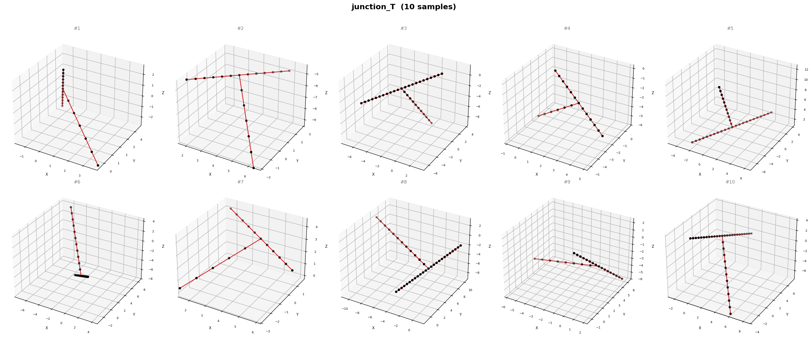 |

## Motif types (for training)

After preprocessing, categories are mapped to 4 motif types:

| motif_type | categories |
|------------|-----------|
| `arc` | `arc_10` .. `arc_170` |
| `straight` | `straight` |
| `corner` | `corner` |
| `junction` | `junction` (merged from junction_T + junction_Y) |

## Why this structure?

- **Nodes + edges = graph** -- directly loadable into GNN frameworks (PyTorch Geometric, DGL).
- **Unit spacing** -- standardises graph density across shapes.
- **Random rigid pose** -- every sample gets a random 3D rotation + translation so the model can't memorise orientation.
- **Per-node features** -- curvature and degree give the network local geometric + topological cues.
- **Junctions share a hub node** -- one node connected to 3 edges, matching real pipe topology.

## Regenerate

```bash
python generate_geometry_dataset.py
```

Generates 10000 samples per category (17 arc classes + straight + corner + junction_T + junction_Y = 21 raw categories, merged to 20 for training).
