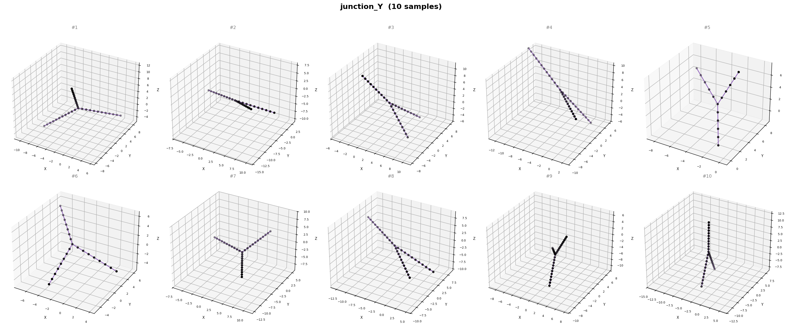

# Shape Geometry Dataset

Synthetic graph-based centerline representations of 3D geometric motifs (pipe-like structures).

## JSON Schema

`dataset.json` is an array of shape records. Each record:

```json
{
  "category": "arc_90",
  "nodes": [[x, y, z], ...],
  "edges": [[i, j], ...],
  "features": {
    "curvature": [0.0, 0.1, ...],
    "segment_angle": [0.0, 160.5, ...]
  }
}
```

| Field | Type | Description |
|-------|------|-------------|
| `category` | string | Shape class label (e.g. `straight`, `arc_90`, `corner`) |
| `nodes` | float[][] (N×3) | 3D points with ~1-unit spacing between neighbors |
| `edges` | int[][] (E×2) | Index pairs connecting nodes |
| `features.curvature` | float[] (N) | Menger curvature per node (0 at endpoints/hubs) |
| `features.segment_angle` | float[] (N) | Angle in degrees between edges at each node |

## Categories

| Category | What it is | Samples |
|----------|-----------|---------|
| `straight` | Random-length line segment (5–20 units) |  |
| `arc_10` | 10° gentle arc, R=10 |  |
| `arc_20` | 20° arc |  |
| `arc_30` | 30° arc |  |
| `arc_40` | 40° arc |  |
| `arc_50` | 50° arc |  |
| `arc_60` | 60° arc |  |
| `arc_70` | 70° arc |  |
| `arc_80` | 80° arc |  |
| `arc_90` | 90° quarter-circle bend |  |
| `arc_100` | 100° arc |  |
| `arc_110` | 110° arc |  |
| `arc_120` | 120° wide arc |  |
| `arc_130` | 130° arc |  |
| `arc_140` | 140° arc |  |
| `arc_150` | 150° near-semicircle |  |
| `arc_160` | 160° arc |  |
| `arc_170` | 170° near-full semicircle |  |
| `corner` | Two straight arms at a sharp 90° angle |  |
| `junction_T` | Through-pipe with perpendicular branch (T-shape) |  |
| `junction_Y` | Trunk splitting into two splayed arms (Y-shape) |  |

## Why this structure?

- **Nodes + edges = graph** — directly loadable into GNN frameworks (PyTorch Geometric, DGL).
- **Unit spacing** — standardises graph density across shapes; a 15-unit straight and a 90° arc at R=10 both have proportional node counts.
- **Random rigid pose** — every sample gets a random 3D rotation + translation so the model can't memorise orientation.
- **Per-node features** — curvature and segment angle give the network local geometric cues beyond raw xyz, helping distinguish arcs from straights even when node counts overlap.
- **Junctions share a hub node** — T and Y shapes have one node connected to 3 edges, matching real pipe topology and giving the GNN a clear topological signal.

## Regenerate

```bash
python generate_geometry_dataset.py
```

Generates 10000 samples per category (17 arc classes + straight + corner + junction_T + junction_Y = 21 categories, 21k samples total).
